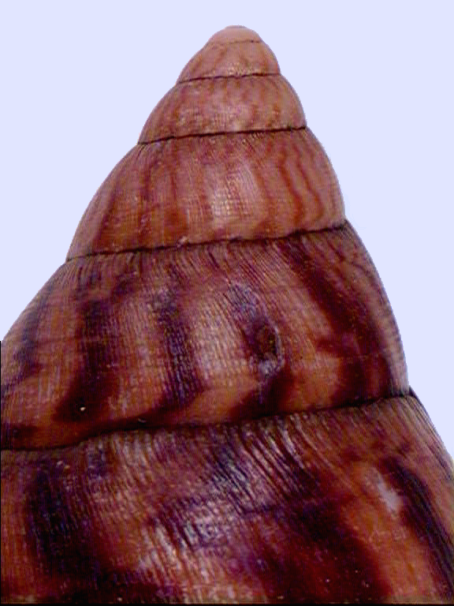
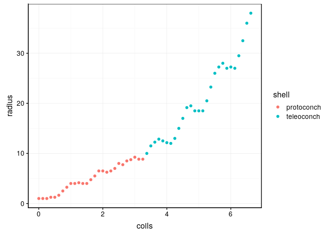

Croissance de la coquille d’escargots géants d’Afrique
================

# Introduction

*Achatina achatina* (Linnaeus, 1758) a été étudié dans le cadre d’une
étude tentant de modéliser la croissance des coquilles.

Le jeu de données `achatina` comprend les variables suivantes :

  - coils : nombre de tours de coquille (sans unité)
  - shell : rayon de la suture mesuré depuis le point de référence
    (apex) en mm

Que l’on peut visualiser dans le graphique ci-dessous.

<!-- -->

Employez la régression linaire afin de modéliser la croissance de la
coquille de ces animaux.

# Objectif

Réalisez un document de type rapport scientifique avec les différentes
parties que comprends généralement un rapport scientifique :

  - Introcduction
  - But
  - M\&M (sommaire)
  - Résultats et discussion
  - Conclusion

N’hésitez pas à diviser votre analyse en 2 parties (protoconch et
teleoconch).

# Note

Les données de cee projet ont été employées dans le cadre de la
publication de Van Osselaer et Grosjean (2000).

# Références

Van Osselaer, Christian, and Philippe Grosjean. 2000. “Suture and
Location of the Coiling Axis in Gastropod Shells.” *Paleobiology* 26
(2). Paleontological Society: 238–57.
<http://www.jstor.org/stable/2666014>.

