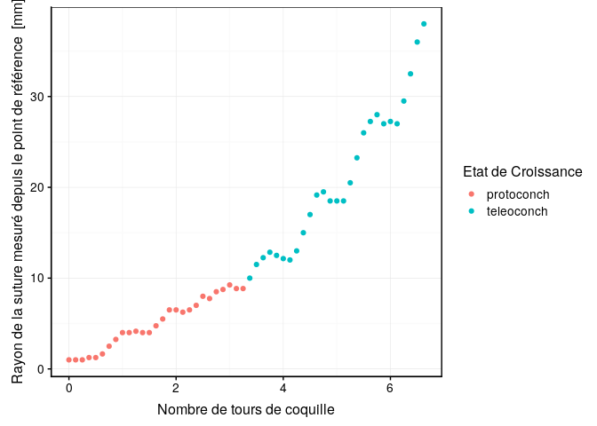

Croissance de la coquille d’escargots géants d’Afrique
================

# Introduction

*Achatina achatina* (Linnaeus, 1758) a été étudié dans le cadre d’une
étude tentant de modéliser la croissance des coquilles.

Le jeu de données `achatina` comprend les variables suivantes :

  - coils : nombre de tours de coquille (sans unité)
  - shell : rayon de la suture mesuré depuis le point de référence
    (apex) en mm

Que l’on peut visualiser dans le graphique ci-dessous.

<!-- -->

Employez la régression linaire afin de modéliser la croissance de la
coquille de ces animaux.

# Objectif

Réalisez un document de type cahier de laboratoire et réalisez l’analyse
de données qui vous sont proposées.

N’hésitez pas à diviser votre analyse en 2 parties (protoconch et
teleoconch)
